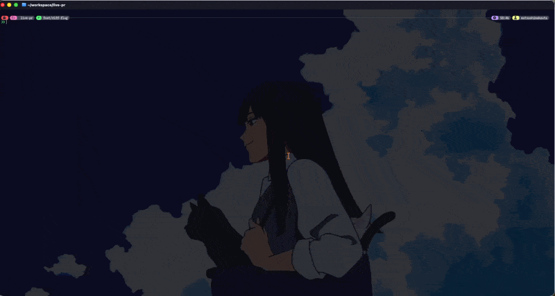

```
╻  ╻╻ ╻┏━╸   ┏━┓┏━┓
┃  ┃┃┏┛┣╸ ╺━╸┣━┛┣┳┛
┗━╸╹┗┛ ┗━╸   ╹  ╹┗╸
```

# live-pr

[](https://github.com/shonenm/live-pr/actions/workflows/ci.yml)
[](https://github.com/shonenm/live-pr/releases/latest)
[](LICENSE)
[](https://goreportcard.com/report/github.com/shonenm/live-pr)

Living pull request for LLM-assisted development.



A GitHub PR records only the compressed final conclusion. The actual
iteration — pivots, discarded approaches, why each decision was made —
happens locally with the coding agent and is thrown away.

live-pr keeps that timeline alive: agents and humans append `decision` /
`pivot` / `note` records during development, you review the branch like a
GitHub PR in a local TUI, and at the end the timeline ships as the body of
a real pull request.

## Features

- Decision timeline — append-only records from humans and agents, editable from the TUI and CLI
- GitHub-PR-style TUI — PR list with views/filters/stacks, and a detail screen with the conversation beside a review pane
- Full conversation sync — PR description, comments, submitted reviews (colored verdicts), inline review comments, and lifecycle activity
- Comment from the TUI — post, edit, and delete GitHub conversation comments; edit the PR description
- Review from the TUI — inline comments plus a verdict (comment / approve / request changes) submitted together
- Pluggable review pane — embedded Neovim CodeDiff, `delta`, or built-in git diff; switch with `--diff`
- Local-first review — checked-out PRs include unpushed commits and staged, unstaged, and untracked files
- LOCAL / LIVE / REMOTE status line — distinguishes local work, a clean checkout matching its PR, and fetched PRs
- Live PR monitoring — LIVE checkouts poll lightweight head, state, draft, and CI metadata without replacing the local review
- PR export — `live-pr pr publish` creates or updates the GitHub PR with the timeline as its body
- Mouse support — wheel scrolling per pane, click to select or open a PR, view tabs, and popup options

## Status

Alpha, and versioned `0.x`. Releases go out several times a day; keybindings,
configuration keys, and on-disk state can change between `0.x` releases without
a deprecation period. `v1.0` is the point where those three stop moving without
a migration path — a goal, not a date.

## Install

With Homebrew (macOS):

```sh
brew install shonenm/live-pr/live-pr
```

Or download a platform archive from [GitHub Releases](https://github.com/shonenm/live-pr/releases):

```sh
version=$(curl -fsSI https://github.com/shonenm/live-pr/releases/latest | tr -d '\r' | sed -n 's#.*/tag/##p')
case $(uname -m) in x86_64) arch=amd64 ;; *) arch=$(uname -m) ;; esac
asset="live-pr_${version#v}_$(uname -s)_${arch}.tar.gz"
tmp=$(mktemp -d)
curl -fL "https://github.com/shonenm/live-pr/releases/download/$version/$asset" -o "$tmp/$asset"
tar -xzf "$tmp/$asset" -C "$tmp"
mkdir -p "$HOME/.local/bin"
install -m755 "$tmp/live-pr" "$HOME/.local/bin/live-pr"
```

Or with Go:

```sh
go install github.com/shonenm/live-pr@latest
```

Requirements: Git. An authenticated GitHub CLI (`gh`) for GitHub browsing,
commenting, reviewing, and publishing. Neovim CodeDiff and `delta` are
optional; raw git diff is built in.

Platforms: macOS and Linux are the supported targets — macOS is what live-pr is
developed on, and the full test suite (plus `go vet` and the race detector) runs
on Linux in CI. The macOS and Windows CI jobs only compile everything and run
the terminal-embedding tests. Releases include a Windows archive, but Windows is
build-verified only: nobody exercises the TUI there, so treat it as untested.

## Quick start

```sh
live-pr demo             # disposable demo, no GitHub resources touched
live-pr                  # open the TUI for the current repository and branch
live-pr --diff=delta     # pick the review pane: git, delta, codediff, codereview, or a command
live-pr pr publish       # push and create/update the GitHub PR from the timeline
```

Press `?` in the TUI for keybindings, or see [docs/keybindings.md](docs/keybindings.md).

## Configuration

`~/.config/live-pr/config.toml`, overridden per-repo by `.live-pr.toml`:

```toml
theme = "primer-dark"        # primer-dark (default) | primer-light | nord | catppuccin-mocha
summarize_command = ""       # summary backend: transcript on stdin, summary on stdout ("" = claude -p)

[diff]
command = 'nvim -c "CodeDiff --inline $LIVE_PR_RANGE"'  # embedded reviewer ("" = built-in git diff)
display = "delta --color-only"                          # static diff filter
split_ratio = 20                                        # conversation : review width (detail screen)
min_pane_width = 60

[list]
split_ratio = 50             # list : preview width on the PR list screen (default 45)
```

See [docs/diff-tool-integration.md](docs/diff-tool-integration.md) for reviewer details.

`diff.command`, `diff.commit_command`, and `summarize_command` are run through a
shell, and `.live-pr.toml` is read from the repository you are viewing — so a
repository you clone can run a command of its author's choosing when you start
live-pr in it, the same exposure as Vim's `exrc`. Review the per-repo
configuration of repositories you do not trust; [SECURITY.md](SECURITY.md)
covers the trust boundaries in full.

## Agent Skill

Teach coding agents when to record decisions:

```sh
gh skill install shonenm/live-pr live-pr --agent claude-code --scope user
```

The binary carries the matching skill version (`live-pr skill path`). A
Claude Code Stop hook (`live-pr init --hooks`) can summarize sessions into
the timeline automatically.

## More

- [docs/keybindings.md](docs/keybindings.md) — full key reference
- [docs/development.md](docs/development.md) — CLI reference, building, debugging
- [docs/prior-art.md](docs/prior-art.md) — how live-pr relates to neighboring tools
- [CONTRIBUTING.md](CONTRIBUTING.md) — how to report bugs and send pull requests
- [SECURITY.md](SECURITY.md) — reporting a vulnerability, and what live-pr runs
  on your machine

## License

[MIT](LICENSE)
