# Local review modes

live-pr shows the source of the review in the left side of the status line.
The pane titles already identify the current UI view; the mode identifies which
repository state the review represents.

## Modes

| Mode | Meaning | Diff source |
| --- | --- | --- |
| `LOCAL` | The checked-out branch has no PR, has commits not on the PR, or has index/worktree changes. | Local `HEAD`, index, worktree, and untracked files |
| `LIVE` | The checked-out branch has a PR, local `HEAD` equals the published PR head, and the worktree is clean. | Local Git, with GitHub metadata layered on top |
| `REMOTE` | A PR that is not the checked-out branch is open from the PR list. | The fetched `refs/live-pr/pulls/<number>/head` ref |

A PR can move from `LIVE` to `LOCAL` without closing the detail screen. A local
commit or file edit makes the checkout local. A changed remote head also leaves
`LIVE` and asks for an explicit refresh rather than replacing a review while it
is being read.

## State transitions

```mermaid
stateDiagram-v2
    [*] --> LOCAL: branch without a matching PR
    LOCAL --> LIVE: publish or refresh; clean HEAD equals PR head
    LIVE --> LOCAL: edit, stage, commit, or remote head update
    LOCAL --> LIVE: push/refresh; clean HEAD equals PR head
    LOCAL --> REMOTE: open another PR
    LIVE --> REMOTE: open another PR
    REMOTE --> LOCAL: return to a changed checkout
    REMOTE --> LIVE: return to a synchronized checkout
```

The status line makes the non-synchronized relation explicit:

- `N ahead` means commits exist only in the checkout;
- `N behind · remote update` means commits exist only on the PR;
- `N ahead · M behind · diverged` means both histories have unique commits;
- `dirty` means the index, worktree, or untracked set differs from `HEAD`.

A force-pushed PR normally appears as diverged until `r` fetches the new PR ref.
The commit picker then shows `Published on PR`, `Local only`, and `Remote only`
sections from the Git graph's common ancestor.

## Local-first data ownership

For the checked-out branch, local Git is authoritative for:

- commits, subjects, and commit dates;
- changed paths, renames, and per-file diffs;
- additions, deletions, and file counts;
- merge base, ahead/behind information, and conflict simulation;
- staged, unstaged, and untracked content.

GitHub remains authoritative for:

- PR title, body, state, and draft state;
- comments, reviews, inline review comments, labels, and assignees;
- linked issues and CI/check results.

The local detail request omits GitHub diff statistics and remote commit text.
It retains commit OIDs so CI rollups can be matched to local commits.

## Automatic refresh

While a checked-out branch detail is open, live-pr checks a lightweight Git
fingerprint every two seconds. The fingerprint includes `HEAD`, branch, index,
worktree, and untracked state. A full local scan runs only when that fingerprint
changes. Same-branch reloads retain the active tab, cursor, focus, and viewport.
An external branch checkout rebuilds the model for the new branch.

When the mode is `LIVE`, live-pr also polls lightweight GitHub head, PR state,
draft state, and check metadata every 15 seconds. Failed requests retry after
30 seconds, one minute, then at a capped two-minute interval. A successful poll
or manual refresh resets the interval. `LOCAL` and `REMOTE` details do not run
this remote poll.

Press `r` for an explicit GitHub refresh. Remote head changes are never applied
to the active local diff implicitly.

## Commit and file views

The commit picker separates commits already published on the PR from commits
that exist only in the checkout or only on the remote PR. Local-only and
remote-only commits remain individually reviewable with `git show`. A
`Working tree` row summarizes staged, unstaged, and untracked entries and opens
the complete local diff. File review includes binary files, symlinks, renames,
deletions, conflicts, and submodule changes.

## Typical workflow

1. Start on a feature branch. Before a PR exists, review commits and working-tree changes in `LOCAL`.
2. Publish the PR. A clean matching checkout becomes `LIVE`; CI and PR state update automatically.
3. Continue editing or committing. The same screen returns to `LOCAL` and preserves its tab, selection, and viewport.
4. Push, then press `r` if needed. The fetched publication boundary updates commit sections and returns to `LIVE` when synchronized.
5. Open another PR from the navigator to inspect its fetched snapshot in `REMOTE`; returning restores the checked-out branch's local review.

## Cache and offline behavior

GitHub metadata is cache-first. Cached conversation and PR metadata render
immediately, then refresh in the background at startup or when explicitly
requested. If GitHub is unavailable, local commits and diffs remain usable and
the status line reports that cached GitHub data is being shown. Authentication
and setup errors are reported separately from network failures.
