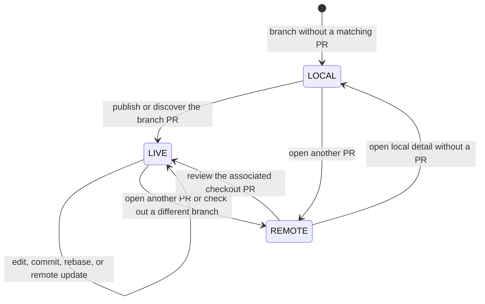

# Local review modes

The status-line mode identifies the review target, not whether the worktree is
clean or whether local and published commits match. Worktree and synchronization
state are shown separately as `dirty`, `ahead`, `behind`, and `diverged`.

## Modes

| Mode | Meaning | Default diff source |
| --- | --- | --- |
| `PR LIST` | The PR navigator is open. This makes no claim about the checkout. | Selected PR preview |
| `LOCAL` | Local detail has no associated GitHub PR. | Local `HEAD`, index, worktree, and untracked files |
| `LIVE` | The reviewed PR is associated with the checked-out branch. | Published PR head, with GitHub metadata layered on top |
| `REMOTE` | The reviewed PR is not the checkout's associated PR. | The fetched PR head |

Editing, staging, committing, rebasing, or receiving a new remote head does not
change a PR-backed review from `LIVE` to `LOCAL`. These operations update its
worktree/revision annotations. Individual commits and the `Working tree` entry
remain separately reviewable without changing which PR the screen belongs to.

## Checkout and PR identity

Opening a PR checks the actual Git checkout before choosing local or remote
review, even if a periodic checkout check just ran. A branch switch during local
hydration rejects that result rather than displaying another branch's Git data.

An implicit branch association prefers an open PR, then the newest PR number.
A stale closed-PR cache does not pin a reused branch to its old PR. An explicit
checkout pins that PR, including forks with a different local branch name;
browsing another PR never silently replaces the pin.

Checkout changes are observed in the list and in both local and remote detail.
A background checkout change keeps the list open or preserves the selected PR.
If that PR is no longer checked out, its review becomes `REMOTE`; opening the
new checkout's PR uses `LIVE`. Browsing and returning with `b` does not discard
the checkout association.

## State transitions

The navigator is labeled `PR LIST`, separately from these detail states.

The status line makes the non-synchronized relation explicit:

- `N ahead` means commits exist only in the checkout;
- `N behind · remote update` means commits exist only on the PR;
- `N ahead · M behind · diverged` means both histories have unique commits;
- `dirty` means the index, worktree, or untracked set differs from `HEAD`.

A force-pushed PR normally appears as diverged after `r` fetches the new PR ref.
The commit picker shows `Published on PR`, `Local only`, and `Remote only`
sections from the Git graph's common ancestor.

## Local-first data ownership

Local Git owns the checkout snapshot: its fingerprint, worktree counts, local
commits, merge base, revision distance, and conflict simulation. Conversation
updates reload conversation content, not a partial worktree snapshot. This
prevents a transient edit observed by one request from leaving a stale `dirty`
flag after another observation returns to a clean fingerprint.

GitHub owns the PR identity and metadata, comments, reviews, inline review
comments, labels, assignees, linked issues, and CI/check results. Same-target
local hydration cannot replace newer GitHub data with its old cache snapshot.
If the PR publication boundary changed during the scan, the local scan is
repeated against the current boundary before being applied.

When the branch has a PR, its fetched publication boundary is authoritative for
changed paths, per-file diffs, and diff statistics. A PR-less branch uses its
local working tree for those views.

## Automatic refresh

A lightweight Git check runs every two seconds on every screen. Its request
identity is independent of detail refreshes, so navigation and `r` cannot
orphan checkout observation. A full local scan runs only when the fingerprint
changes while local detail is active and no conflicting operation is running.
Same-branch reloads retain the active tab, cursor, focus, and viewport.

An open `LIVE` PR also polls lightweight GitHub head, PR state, draft state,
and check metadata every 15 seconds, including while the worktree is dirty.
Failed requests retry after 30 seconds, one minute, then a capped two-minute
interval. Local reload completion reconciles both local and GitHub/CI timers.
`LOCAL` and `REMOTE` details do not run this GitHub poll.

Press `r` for an explicit GitHub refresh. A head change reports that refresh is
required while keeping the active review range unchanged; background status
polling continues. Remote updates are not silently substituted into the diff.

## Commit and file views

The commit picker separates commits already published on the PR from commits
that exist only in the checkout or only on the remote PR. Local-only and
remote-only commits remain individually reviewable with `git show`. A
`Working tree` row summarizes staged, unstaged, and untracked entries and opens
the complete local diff. The Files view stays on the pushed PR head and includes
binary files, symlinks, renames, deletions, conflicts, and submodule changes.

## Typical workflow

1. Start on a feature branch without a PR and review it in `LOCAL`.
2. Publish or discover its PR. The associated review becomes `LIVE`.
3. Edit or commit. The review stays `LIVE`; `dirty` and revision counts change.
4. Push, then press `r`. The fetched publication boundary and diff update.
5. Press `b` for `PR LIST`, then open another PR in `REMOTE` or return to the checkout's PR in `LIVE`.

## Cache and offline behavior

GitHub metadata is cache-first. Cached conversation and PR metadata render
immediately, then refresh in the background at startup or when explicitly
requested. If GitHub is unavailable, local commits and diffs remain usable and
the status line reports that cached GitHub data is being shown. Authentication
and setup errors are reported separately from network failures.
